Modelling Cancer Treatment Survivability Rate with Weibull Power
Function

{width="3.1718755468066493in"
height="2.435278871391076in"}

Omkar Sachin Patankar

James Williams

David Nieves-Acaron

Anshul Maurya

MTH 5411

December 7, 2022

Dr. Nezamoddin Nezamoddini-Kachouie

**TABLE OF CONTENTS**

[1 Abstract](#abstract) **3**

**[2 Introduction/Background](#introductionbackground) 4**

> [2.1 Exploring The Data](#exploring-the-data) 4
>
> [2.2 The Weibull Power Function](#the-weibull-power-function) 6
>
> [2.3 Characterization of the Weibull Power
> Function](#characterization-of-the-weibull-power-function) 7
>
> [2.4 Characterization of the Hazard
> Function](#characterization-of-the-hazard-function) 10
>
> [2.5 Background Summary](#background-summary) 12

**[3 Methodology](#methodology) 13**

> [3.1 Creating the MLE and Gradient](#creating-the-mle-and-gradient) 13
>
> [3.2 Simplifying the Parameters](#simplifying-the-parameters) 14
>
> [3.3 Initial Parameter Values](#initial-parameter-values) 15
>
> [3.4 Code Used](#code-used) 15

**[4 Results](#results) 18**

> [4.1 MLE Convergence Verification](#mle-convergence-verification) 18
>
> [4.2 Estimated Parameters and Data
> Fitting](#estimated-parameters-and-data-fitting) 19
>
> [4.3 Comparing the 3 Datasets](#comparing-the-3-datasets) 20

[5 Discussions/Conclusion](#discussionsconclusion) **24**

> [5.1 Conclusion](#conclusion) 24
>
> [5.2 Challenges](#challenges) 24

[6 References](#references) **25**

**[Appendix](#appendix) 26**

> [Phi Convergence Graphs](#phi-convergence-graphs) 26

Abstract
========

The Weibull Power Function is an altered version of the well-known
Weibull distribution. The purpose of this report is to characterize all
four parameters of this distribution, and to determine its ability to
characterize any particular dataset. Specifically, this report will be
using a dataset involving time to failure for cancer patients with data
on their most recent physical state, sex, age, and other
characteristics. The Weibull Power Function is listed below:

$F\left( t \right) = 1 - e^{- \nu\left\lbrack \frac{t^{\lambda}}{\varphi^{\lambda} - t^{\lambda}} \right\rbrack^{\omega}},\ \ t > 0,\ \ \varphi > t$

Throughout this report, it will become necessary to characterize the
distribution with different visualization techniques, simplify the
4-dimensional solution space, and use numerical optimization methods to
calculate all four parameters given in F(t) to model the probability
distribution using the Maximum Likelihood function. Optimization
algorithms (the optim and maxLik functions) employed in RStudio were
used across a wide array of initial parameters to calculate the
parameters that optimize the Maximum Likelihood Function until an
accepted level of accuracy was found.

2.  Introduction/Background
    =======================

    1.  Exploring The Data
        ------------------

The dataset used in this project consists of medical data detailing the
details surrounding a patient's lung cancer diagnosis and subsequent
survival time. The listed fields include the following: inst, which
indicates the institution code; time, which indicates the survival time
of the patient in days; status, which indicates the censoring status (1
meaning censored, and 2 meaning dead); age meaning the age in years; sex
meaning the person's sex or gender, with a male value evaluating to 1
and a female value evaluating to 2; age referring to the person's age in
terms of years; ph.ecog representing the ECOG performance (a metric used
to detail a disease's progress); ph.karno, representing the physician's
rated karnofsky score (a score referring to a person's functional
impairment with regards to a disease) ; pat.karno, representing the
patient's rated karnofsky score; meal.cal representing the calories
consumed for every meal; finally, wt.loss representing the weight loss
in the last six months in terms of pounds.

Upon inspection of the dataset, it was found that there is a
significantly larger chance of failure when the $t\  < \ 420\ $days,
indicating a positive skew in this regard. Besides that, the age seems
to be normally distributed with the average hovering around the
60's.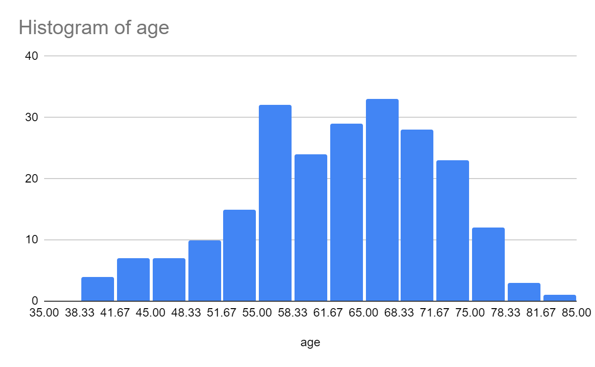{width="2.9785181539807524in"
height="1.8382272528433945in"}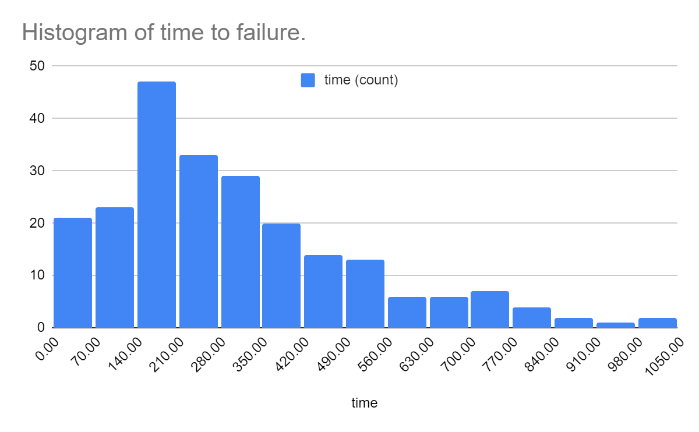{width="2.9531255468066493in"
height="1.8165266841644794in"}

In addition to this, there seem to be significantly more samples of men
than there are of women, which led to some repercussions on the
parameter estimation in the later sections.

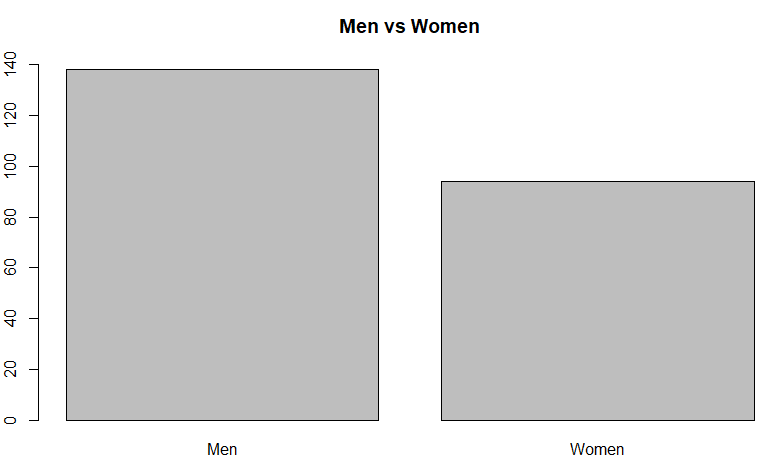{width="2.5989588801399823in"
height="1.5943963254593176in"}

In general, this likely entails for the parameter estimation that this
abundance of male samples likely skews the overall results to be more
similar to the men's distribution vs the women.

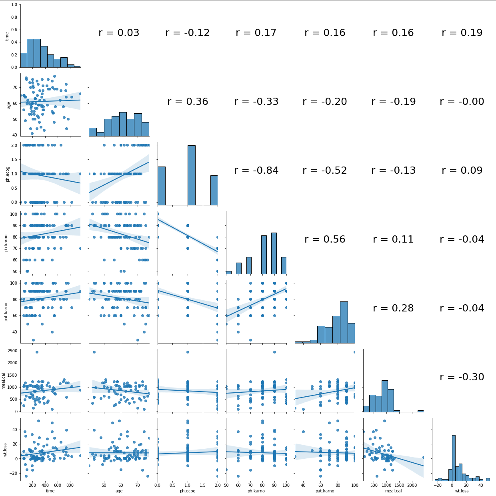{width="3.8951334208223973in"
height="3.8951334208223973in"}

The correlogram above was generated using Python's Seaborn library.
Correlograms can be a very useful tool for analyzing data before
attempting any kind of statistical analysis or modeling. On the upper
right there are the correlation values for each of the columns and rows
of information. Naturally, one only needs to show the bottom left since
the top right would be repeated information from the bottom left. The
diagonal shows a histogram of each of the fields, whereas the bottom
left shows how the selected values of the data relate to each other in a
2D plot.

Based on the correlogram, a somewhat significant relationship between
the ph.karno and ph.ecog values as well as the ph.karno and pat.karno
values can be seen. However, these relations aren't terribly important
to the discussion since one would expect the ph.karno and ph.ecog values
to be related, since they both come from the same source of truth (the
patient) and they both relate to how the patient feels he/she is
feeling. There are some other correlations such as the one between
ph.ecog and pat.karno which follow somewhat similar lines of thought. In
general, the data has no 1:1 correlation in the fields that will be
analyzed for the Weibull Power Function. The purpose of analyzing the
data beforehand is to see which aspects of the data matter and may
directly impact the results. Without analyzing the data beforehand, it
can be difficult to understand how best to model the data.

The Weibull Power Function
--------------------------

The Weibull Power function attempts to extend the well-known Weibull
distribution to give more control over the distribution. From Tahir et
al (see References, Lemma 2.1 of the paper), it can be seen that a
Weibull Power Function is a composition of a random variable $Y$ with a
weibull distribution in the following manner:

$$\alpha\ \lbrack\frac{Y}{1\  + \ Y}\rbrack^{(\frac{1}{\beta})}$$

While the Weibull distribution has shape parameters $a,b$, the Weibull
Power Function has shape parameters $a,b,\alpha,\beta$.

The hazard function provided by the Weibull distribution is a more
generalized lifetime function. Since our dataset of cancer patients
needs something based on real lifetime models, choosing the Weibull
function to model our data should be our obvious choice. However, the
first calculation needed is the probability distribution (PDF), f(t),
and our hazard function, H(t), from the previously listed cumulative
probability distribution (CDF) F(t).

Deriving f(t):

$$f\left( t \right) = F^{'}\left( t \right) $$

$$= d/dt\left( 1 - e^{- \nu\left\lbrack \frac{t^{\lambda}}{\varphi^{\lambda} - t^{\lambda}} \right\rbrack^{\omega}} \right) $$

$$=e^{- \nu\left\lbrack \frac{t^{\lambda}}{\varphi^{\lambda} - t^{\lambda}} \right\rbrack^{\omega}}*\left\lbrack \left( \nu t^{\lambda\omega - 1}\text{λω} \right)*\left( \varphi^{\lambda} - t^{\lambda} \right)^{- \omega} + \left( \nu t^{\text{λω}} \right)*\left( \varphi^{\lambda} - t^{\lambda} \right)^{- \omega - 1}\left( - \omega \right)*\left( - \lambda t^{\lambda - 1} \right) \right\rbrack $$

$$= e^{- \nu\left\lbrack \frac{t^{\lambda}}{\varphi^{\lambda} - t^{\lambda}} \right\rbrack^{\omega}}*\left\lbrack \frac{\text{νωλ}t^{\lambda\omega - 1}\left( \varphi^{\lambda} - t^{\lambda} \right)}{\left( \varphi^{\lambda} - t^{\lambda} \right)^{\omega + 1}} + \frac{\text{νωλ}t^{\text{λω}}t^{\lambda - 1}}{\left( \varphi^{\lambda} - t^{\lambda} \right)^{\omega + 1}} \right\rbrack $$

$$= e^{- \nu\left\lbrack \frac{t^{\lambda}}{\varphi^{\lambda} - t^{\lambda}} \right\rbrack^{\omega}}*\left\lbrack \frac{\text{νωλ}t^{\lambda\omega - 1}\varphi^{\lambda} - \nu\omega\lambda t^{\lambda\omega - 1 + \lambda} + \nu\omega\lambda t^{\lambda\omega + \lambda - 1}}{\left( \varphi^{\lambda} - t^{\lambda} \right)^{\omega + 1}} \right\rbrack$$

$$= e^{- \nu\left\lbrack \frac{t^{\lambda}}{\varphi^{\lambda} - t^{\lambda}} \right\rbrack^{\omega}}\frac{\text{νωλ}t^{\lambda\omega - 1}\varphi^{\lambda}}{\left( \varphi^{\lambda} - t^{\lambda} \right)^{\omega + 1}}$$

Therefore,
$$f\left( t \right) = \frac{\text{νωλ}\varphi^{\lambda}t^{\omega\lambda - 1}}{\left\lbrack \varphi^{\lambda} - t^{\lambda} \right\rbrack^{\omega + 1}}e^{- \nu\left\lbrack \frac{t^{\lambda}}{\varphi^{\lambda} - t^{\lambda}} \right\rbrack^{\omega}}$$

Since each value of F(t) and f(t) must be between 0 and 1, and that the
data has a maximum t value of 1022, assumptions can be made for the
entire dataset:

$\nu,\omega,\lambda > 0,\ and\ \varphi > 1022 \geq t > 0$

Calculating h(t):

$$h\left( t \right) = \frac{f\left( t \right)}{S\left( t \right)} = \frac{f\left( t \right)}{1 - F\left( t \right)} = \frac{\text{νωλ}\varphi^{\lambda}t^{\omega\lambda - 1}}{\left\lbrack \varphi^{\lambda} - t^{\lambda} \right\rbrack^{\omega + 1}}$$

The regular Weibull distribution is

$$F\left( t \right) = 1 - e^{- \left\lbrack x/\lambda \right\rbrack^{k}}$$

Given the PDF and CDF equations above, it can be seen that there are
direct comparisons to the original Weibull equation shown above. For
example, creating the comparison of k =$\lambda$\*$\omega$, can change
the hazard and overall CDF in many ways, and this detail will be
explored in other sections. Comparing both the equations, it can be seen
that there are two extra parameters which will add plenty of complexity
to the solution space.

Characterization of the Weibull Power Function
----------------------------------------------

From *F(t),* there are four parameters that control the Weibull CDF. In
order to characterize the parameters for this model, we will fix any
three parameters at a time and iterate over a non-fixed variable. The
below graph shows an example of the approach mentioned above. The
parameters $\omega$, $\lambda$, and φ are fixed and varying the $\nu$.

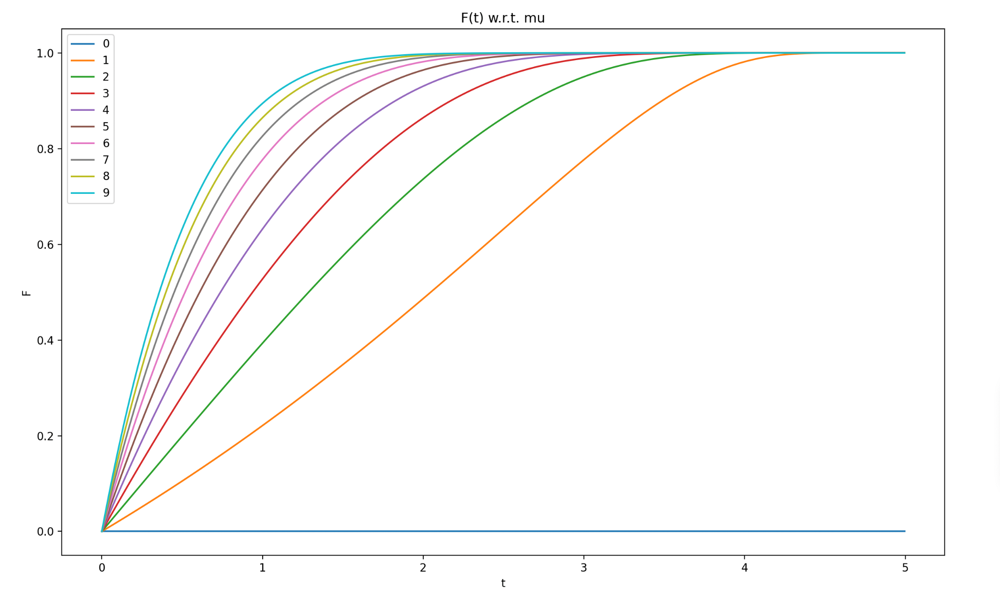{width="5.65625in"
height="2.7596128608923887in"}

Naturally, F(t) convergences as expected at 1. However, more notably, it
can be seen that as $\nu$ changes from 0 to 9, that this parameter is
determining the initial steepness of the distribution's curve. Clearly,
it can be seen that $\nu$=0 is not a valid value since F(t)=0 at this
value. Repeating the same procedure with the other three parameters
leads to different variations of the CDF.

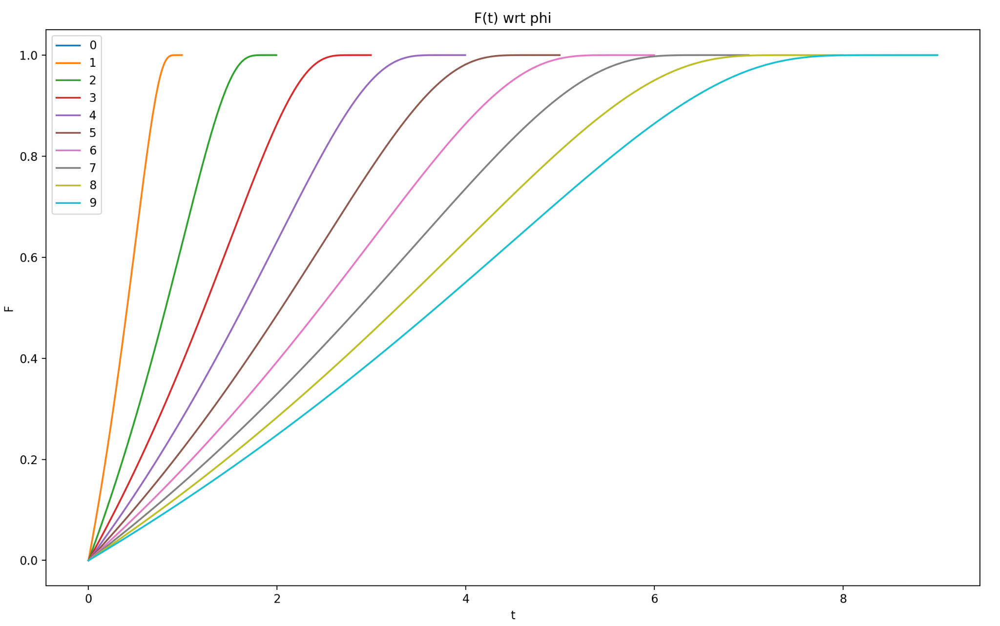{width="5.042771216097988in"
height="3.234041994750656in"}

As $\varphi$ changes, it is clear that the φ determines the domain of
F(t). Since the overall limitation of φ\>t on the model, the
distribution has a clearly bounded solution space for t to be between 0
and φ. Regardless of the value of φ, the CDF will always reach its
maximum value of 1 just before reaching φ.

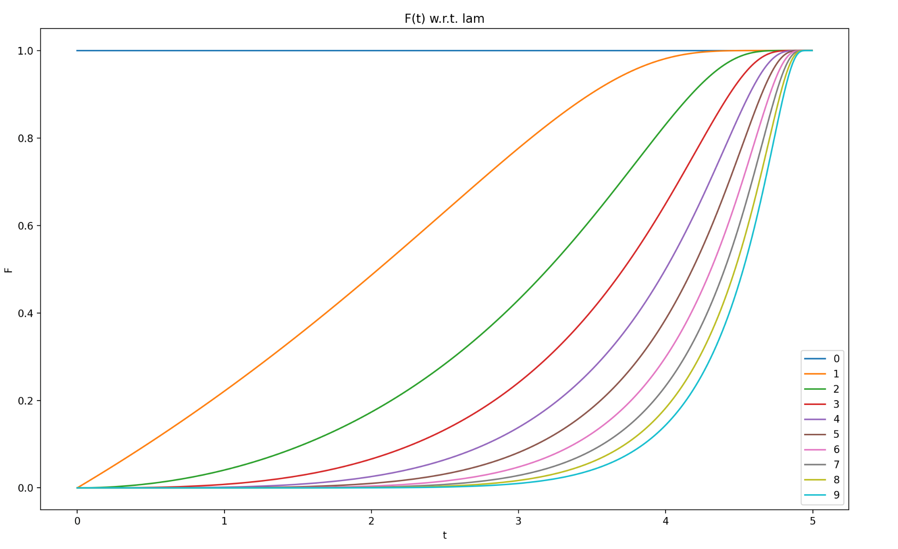{width="5.076620734908136in"
height="3.1843503937007873in"}

While $\nu$ determining the CDF's "top" curve as it converges to 1, it
can be seen that $\lambda$ it determines the CDF's "bottom" curve before
it takes a steep turn toward 1. Overall, as $\lambda$ is changing from 0
to 9, it determines how late the distribution begins its initial "s"
curve.

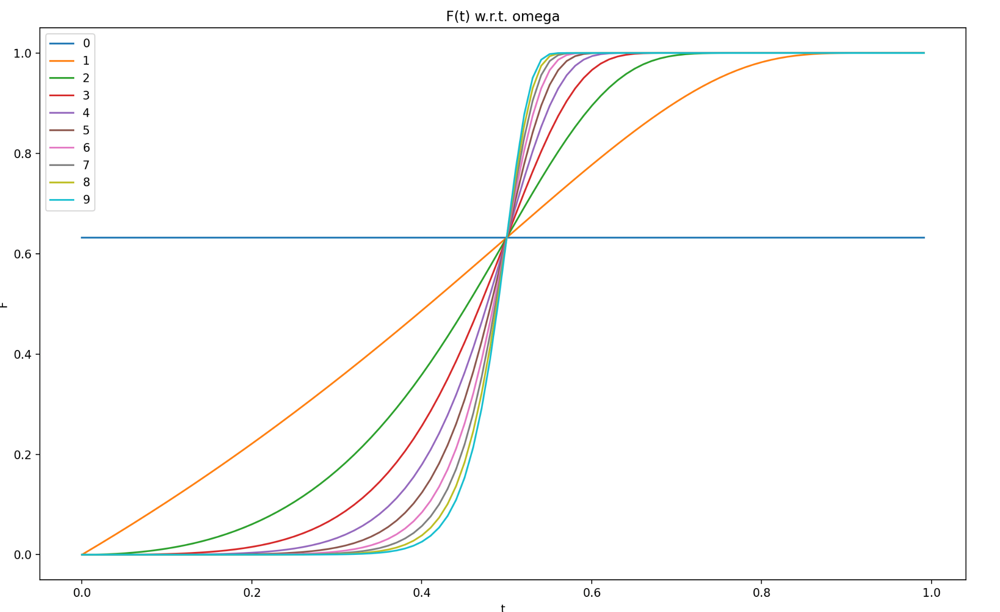{width="5.76732939632546in"
height="3.5587423447069115in"}

As seen above, $\omega$ determines the curve\'s steepness after its
initial turn upwards but before the second curve towards its convergence
to 1. This can be determined by the fact that each of the curves crosses
the same point in the middle of the distribution (which is determined by
the combination of the other 3 parameters).

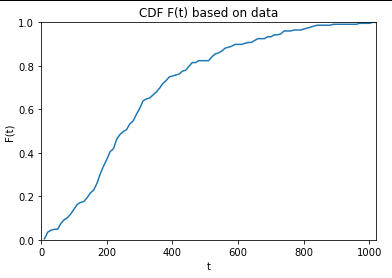{width="4.083333333333333in"
height="2.8523622047244093in"}

The above graph shows the CDF that the provided lung cancer shows. After
characterizing the parameters and visualizing the data in this way, it
can be seen that the following trends for an initial guess at the
estimated parameters:

-   A straight line upwards at the start means that there is either a
    > small λ, or a large λ and a small ω\*λ.

-   A φ value larger than the max t value of the dataset is needed to
    > determine the right bound of the graph.

-   The final part of the distribution curve suggests a median value for
    > μ (approx 5 or 6).

-   The near-standard line for the first half of the distribution
    > suggests a low value for ω (approx 1).

    1.  Characterization of the Hazard Function
        ---------------------------------------

Repeating the same procedure as we did above for F(t) on our hazard
function, h(t), will generate the below graphs:

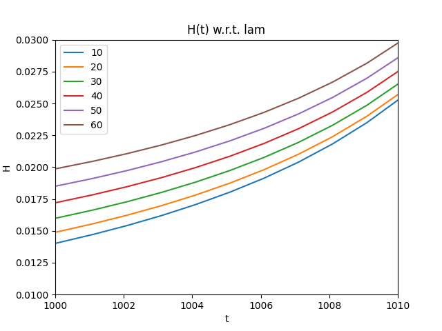{width="3.025878171478565in"
height="2.2610958005249344in"}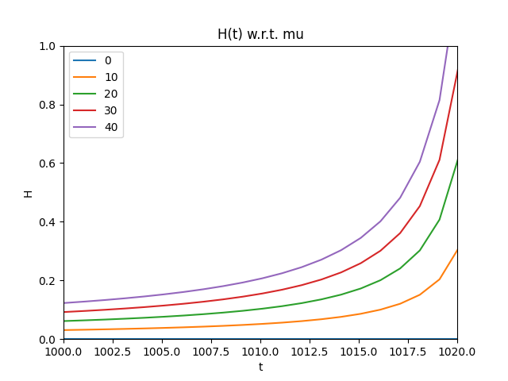{width="3.0119739720034997in"
height="2.2589807524059493in"}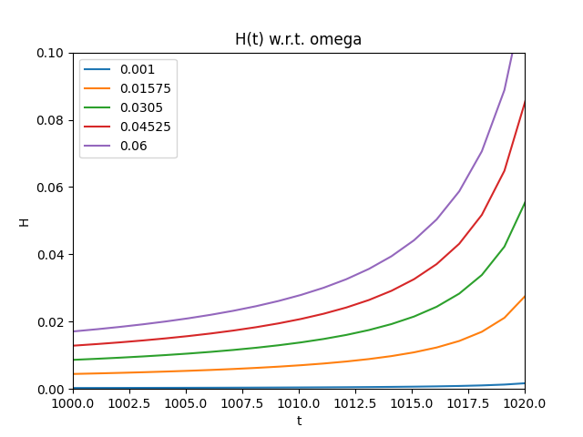{width="3.0052088801399823in"
height="2.2600142169728783in"}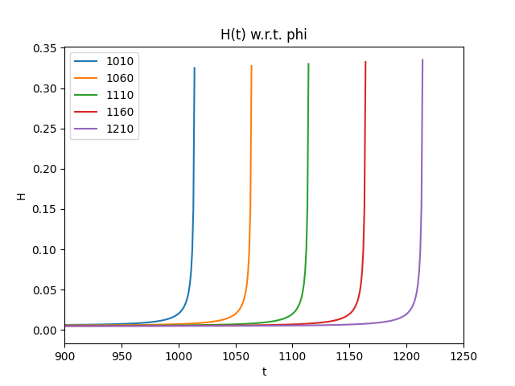{width="3.0468755468066493in"
height="2.287791994750656in"}

As shown from the above hazard plots, all 4 parameters seem to change
the hazard function similarly, but there is not a clear difference in
how each of the parameters changes the hazard function (aside from the
obvious right limit in the domain from φ. There is extra changes in
shape when looking specifically at the parameters ω and λ, as shown
below.

{width="3.2213921697287837in"
height="1.9569280402449694in"} {width="3.219886264216973in"
height="1.9659897200349956in"}

When looking closely at the pictures above, it can be seen that the
shape of the hazard function changes from a steady increasing function
to a bathtub-like shape based on the changes in curvature in the initial
values of t. These two parameters are the only ones to change the shape
for a specific reason. As noted earlier, there is a direct relationship
with k = λ \* ω from the original Weibull distribution. Specifically,
when k \< 1, then the hazard will see a bathtub shape, and it will have
a steady increase otherwise (see Tahir et al. Theorem 2.3). A zoomed in
view of these curves are seen below.

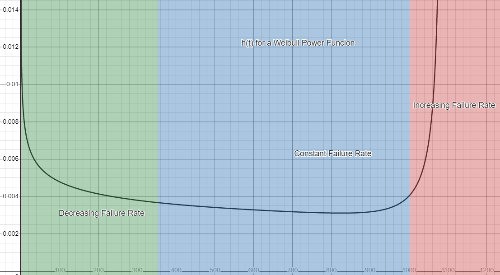{width="6.494792213473316in"
height="3.6242268153980755in"}

{width="6.5in"
height="3.236111111111111in"}

Background Summary
------------------

As seen from the above introduction of this model, each of the
parameters for *F(t)* and *h(t)* significantly change the curve of the
probability distributions. It can be visually seen from the above graphs
to determine what set of initial parameters would be best as a first
guess during the numerical methods described later. The Weibull Power
distribution could be helpful in real life application of reliability
analysis as its plots can take many different shapes by controlling the
function's parameters, thus allowing it to have adaptability for many
different situations.

3.  Methodology
    ===========

    1.  Creating the MLE and Gradient
        -----------------------------

One of the most common methods to determine the values of the parameters
for a given distribution is to calculate the Maximum Likelihood
Estimation for f(t), and then maximize this equation to give the best
output. However, this alone can prove to be computationally complex, so
taking the natural logarithm of this equation will give the same optimal
result for the parameters.

$\text{MLE}\left( \nu,\omega,\lambda,\varphi \right) = f\left( t \right) = \frac{\text{νωλ}\varphi^{\lambda}t^{\omega\lambda - 1}}{\left\lbrack \varphi^{\lambda} - t^{\lambda} \right\rbrack^{\omega + 1}}e^{- \nu\left\lbrack \frac{t^{\lambda}}{\varphi^{\lambda} - t^{\lambda}} \right\rbrack^{\omega}}$

Where the product is in reference to each of the values of t in the
given dataset. Since the MLE is unusable in this form, the
log-likelihood (L) will need to be calculated, as well as each of the
partials:

$L = ln\left( \text{MLE}\left( \nu,\omega,\lambda,\varphi \right) \right) = \ln\left( \frac{\text{νωλ}\varphi^{\lambda}t^{\omega\lambda - 1}}{\left\lbrack \varphi^{\lambda} - t^{\lambda} \right\rbrack^{\omega + 1}}e^{- \nu\left\lbrack \frac{t^{\lambda}}{\varphi^{\lambda} - t^{\lambda}} \right\rbrack^{\omega}} \right) = n\left\lbrack \ln\left( \nu \right) + ln\left( \omega \right) + ln\left( \lambda \right) + \lambda ln\left( \varphi \right) \right\rbrack + \left\lbrack \left( \omega\lambda - 1 \right)\ln\left( t \right) - \left( \omega + 1 \right)\ln\left( \varphi^{\lambda} - t^{\lambda} \right) - \nu\left\lbrack \frac{t^{\lambda}}{\varphi^{\lambda} - t^{\lambda}} \right\rbrack^{\omega} \right\rbrack$

In order to perform the maximization of this equation, the partials for
each of the four parameters will need to be calculated, and then
determined if this is truly a maximization of L (and thus, the MLE).
These equations turn out to be the following:

$$\frac{\text{δL}}{\text{δν}} = \frac{n}{\nu} - \left\lbrack \frac{t^{\lambda}}{\varphi^{\lambda} - t^{\lambda}} \right\rbrack^{\omega}$$

$$\frac{\delta^{2}L}{\text{δν}^{2}} = \frac{- n}{\nu^{2}} < 0$$

$$\frac{\text{δL}}{\text{δω}} = \frac{n}{\omega} + \left\lbrack \text{λln}\left( t \right) - ln\left( \varphi^{\lambda} - t^{\lambda} \right) - \nu\left\lbrack \frac{t^{\lambda}}{\varphi^{\lambda} - t^{\lambda}} \right\rbrack^{\omega}*ln\left( \frac{t^{\lambda}}{\varphi^{\lambda} - t^{\lambda}} \right) \right\rbrack$$

$$\frac{\delta^{2}L}{\text{δω}^{2}} = \frac{- n}{\omega^{2}} - \left\lbrack \nu\left\lbrack \frac{t^{\lambda}}{\varphi^{\lambda} - t^{\lambda}} \right\rbrack^{\omega}*\ln^{2}\left( \frac{t^{\lambda}}{\varphi^{\lambda} - t^{\lambda}} \right) \right\rbrack < 0$$

$$\frac{\partial L}{\partial\lambda} = n\left\lbrack \ln\left( \nu \right) + ln\left( \omega \right) + ln\left( \lambda \right) + \lambda ln\left( \varphi \right) \right\rbrack + \left\lbrack \left( \omega\lambda - 1 \right)\ln\left( t \right) - \left( \omega + 1 \right)\ln\left( \varphi^{\lambda} - t^{\lambda} \right) - \nu\left\lbrack \frac{t^{\lambda}}{\varphi^{\lambda} - t^{\lambda}} \right\rbrack^{\omega} \right\rbrack$$

$$\frac{\text{δL}}{\text{δφ}} = \frac{\text{nλ}}{\varphi} + \left\lbrack - \frac{\left( \omega + 1 \right)\lambda\varphi^{\lambda - 1}}{\varphi^{\lambda} - t^{\lambda}} - \nu\lambda\omega t^{\text{λω}}{\varphi^{\lambda - 1}\left\lbrack \varphi^{\lambda} - t^{\lambda} \right\rbrack}^{- \omega - 1} \right\rbrack$$

As seen above, these gradients can be quite complex. It can be proven
that any optimization of the parameters $\omega$ and $\nu$ will be a
guaranteed maximization of the MLE with respect to the second order
derivatives. Thus, giving us the true estimated parameters for each of
these equations. However, the same cannot be determined for the
parameters $\lambda$ and $\varphi$, since second order gradients cannot
be explicitly proven to be strictly positive. Due to the complexity of
the above partials, it is also clear that the solution space will be
computed numerically using various numerical optimization techniques.

Simplifying the Parameters
--------------------------

When performing any type of optimization, it is usually best to simplify
the problem before performing the optimization. Currently, there are 4
unknown parameters to solve, but there are simplifications given the
above information to simplify the solution space. When performing the
optimization of the MLE function, the estimates found must be directly
related to the true values for the solution space. Using the above
derivatives found with optimization techniques, it can be seen that:

$$\frac{\text{δL}}{\text{δν}} = \frac{n}{\nu} - \left\lbrack \frac{t^{\lambda}}{\varphi^{\lambda} - t^{\lambda}} \right\rbrack^{\omega} = 0$$

$$\nu = \frac{n}{\left\lbrack \frac{t^{\lambda}}{\varphi^{\lambda} - t^{\lambda}} \right\rbrack^{\omega}}$$

Next, it can be proven what the true estimated value of $\varphi$ should
be. Let's consider a subfunction of L that only considers the parts that
have $\varphi$ included:

$$P = n\lambda ln\left( \varphi \right) - \left\lbrack \left( \omega + 1 \right)\ln\left( \varphi^{\lambda} - t^{\lambda} \right) + \nu\left\lbrack \frac{t^{\lambda}}{\varphi^{\lambda} - t^{\lambda}} \right\rbrack^{\omega} \right\rbrack$$

Using the above P, and the solution for $\nu$:

$with\ T = max(t_{i})$

$$P\text{\ \ } = \text{nλln}\left( T \right) - \lim_{\varphi \rightarrow T^{+}}\left\lbrack \left( \omega + 1 \right)\ln\left( \varphi^{\lambda} - t^{\lambda} \right) + \frac{n}{\left\lbrack \frac{t^{\lambda}}{\varphi^{\lambda} - t^{\lambda}} \right\rbrack^{\omega}}\left\lbrack \frac{t^{\lambda}}{\varphi^{\lambda} - t^{\lambda}} \right\rbrack^{\omega} \right\rbrack$$

The leading terms in the summation that will be affecting the limit the
most will be when t = T, and all the other values will be much smaller
values in comparison. Thus, the limit acn simplify to:

$P\  = \text{nλln}\left( T \right) - \left( \omega + 1 \right)\lim_{\varphi \rightarrow T^{+}}\ln\left( \varphi^{\lambda} - T^{\lambda} \right) - \lim_{\varphi \rightarrow T^{+}}\frac{n}{\left\lbrack \frac{T^{\lambda}}{\varphi^{\lambda} - T^{\lambda}} \right\rbrack^{\omega}}\left\lbrack \frac{T^{\lambda}}{\varphi^{\lambda} - T^{\lambda}} \right\rbrack^{\omega} = \infty$

Since taking a $\varphi$ close to T will clearly maximize the MLE
function, then is can be assumed that $\varphi$ is a constant value
significantly close to T. Thus, our solution set changes from four
parameters down to two (λ and ω) since $\varphi$ to be equal to just
over T.

Initial Parameter Values
------------------------

Since both ω and λ are higher level exponents for the distribution, they
cannot be extremely large values, otherwise overflows in the code will
occur. Initially, parameters for λ and ω were tested with even higher
values to see how the log-likelihood would behave. Also, ω values tended
to yield poor results when going above 1, which is testing started from
the interval from 0 to 1. Due to the analysis in the introduction as
well as these preliminary tests, values between 0 and 100 for λ, and
values between 0 and 1 for ω will be used.

It should be noted that these parameters are merely estimates that are
assumed to be close enough to the overall population since the data on
the overall population of lung cancer patients is not available. In
addition, based on the sensitivity of the optimizers to initial values,
it could be argued that the parameter estimates obtained are in fact not
the values which cause a global maximum. The only way one could obtain
the true values is by performing this same type of project on the whole
population of people with lung cancer. However, due to finite resources,
this is not feasible.

Code Used
---------

The code used in this project consisted of a multi-language approach
whereby both RStudio and Python provided benefits. The bulk of the
optimization was produced in R, mainly using the optim and maxLik
functions. Taking the initial guesses using the educated guesses
mentioned above along with these functions provide two methods to be
able to reach an optimal answer for this project. Below are examples of
such code.

{width="6.035349956255468in"
height="2.4614227909011372in"}

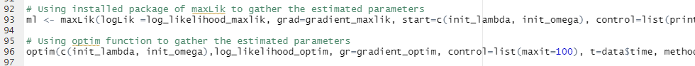{width="6.5in" height="0.6111111111111112in"}

Python code was mainly used for data visualization and providing clean
plots for the data and final results. For instance, a correlogram using
the Seaborn library in Python in order to characterize the data and
determine if there were any initial correlations that could be found
between any of the columns for each sample. Furthermore, this was used
as a simple way to create plots to overlay the PDF, CDF and hazard
functions of the results and calculated from the data, along with easy
addition and manipulation of text boxes and legends. Below are examples
of such code.

{width="4.646235783027121in"
height="4.448301618547681in"}

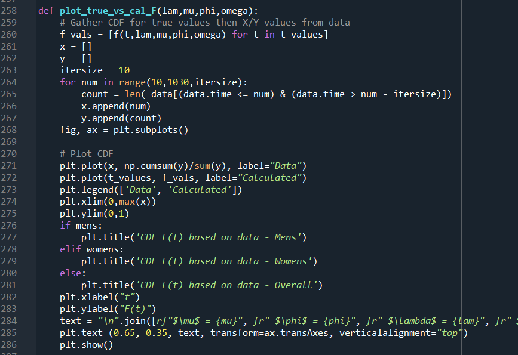{width="4.688290682414698in"
height="3.2088746719160106in"}

4.  Results
    =======

    1.  MLE Convergence Verification
        ----------------------------

Since convergence of these two parameters could not be verified
analytically, visual analysis of the two parameters gives the following
graphs for the MLE:

{width="2.902956036745407in"
height="2.123236001749781in"}{width="2.927538276465442in"
height="2.1406255468066493in"}

Using these graphs and the equations calculated previously, clearly the
MLE values are non-monotonic with a clear maximum value somewhere in the
aforementioned range for the two parameters. Using larger values for
either of these parameters results in breaks within the optimization
code, and inevitably divergence from the true solution.

Before simplification of the φ value, convergence values started higher
than 1022 and 965 for the men's and women's datasets, respectively,
since it was for these values that the PDF was defined. Surprisingly,
the optimizer would set φ to be almost equal to values equal to the
maximum of the times of the dataset. The graph below visually proves
this concept for each iteration of an example optimization. More
examples of this graph are shown in the Appendix with different starting
values and the 3 different data sets (overall, mens, and womens).

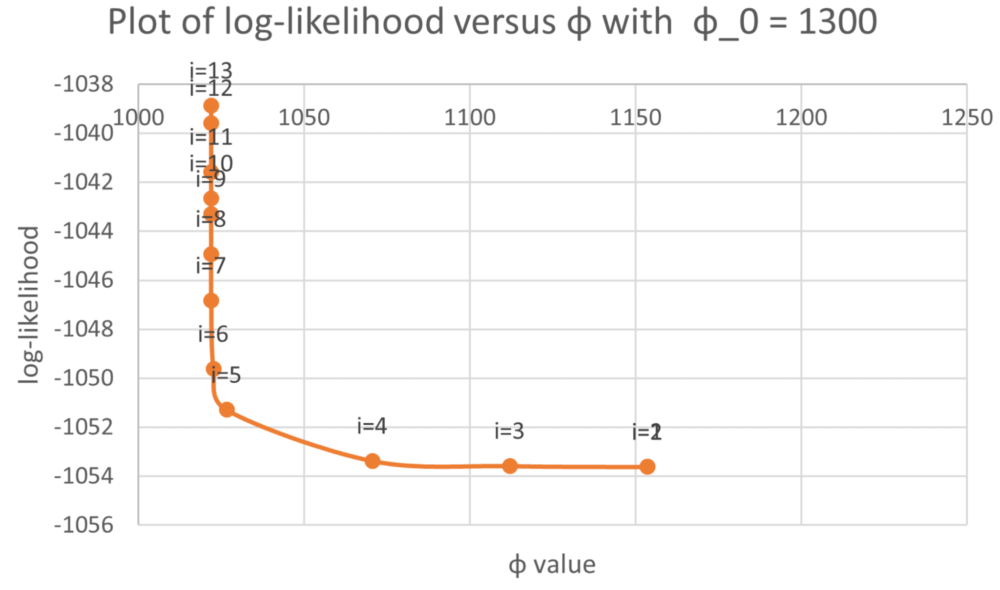{width="4.073918416447944in"
height="2.4068416447944005in"}

Estimated Parameters and Data Fitting
-------------------------------------

One attempt at optimization is to keep some of the variables constant,
and then optimize the parameters one at a time. The results for this
style of testing are shown below.

  | **[Ind. Optimized Parameter Value]** | **[Combined]** | **[Male]** | **[Female]** |
|--------------------------------------------------|----------------------------|------------------------|--------------------------|
| $\lambda$                                        | 63.3251                    | 57.8361                | 75.1015                  |
| $\varphi$                                        | \~1022                     | \~1022                 | \~965                    |
| $\omega$                                         | 0.03012                    | 0.02755                | 0.03578                  |

However, the more accurate technique to perform optimization is done by
optimizing all the parameters at the same time. When simplifying MLE to
be a function of only $\omega$ and $\lambda$ and then performing the
optimization, we arrive at the following results below.

| **[Parameter Values]** | **[Combined]** | **[Male]** | **[Female]** |
|------------------------------------|----------------------------|------------------------|--------------------------|
| 𝞴                                  | 50.66104                   | 48.43294               | 38.4                     |
| 𝝋                                  | \~1022                     | \~1022                 | \~965                    |
| 𝛚                                  | 0.02626212                 | 0.02718752             | 0.03818065               |
| $\nu$                              | 4.477732                   | 4.753729               | 3.93184                  |
| Max ln(MLE)                        | -1037.059                  | -614.063               | -402.5507                |
All the values above seem fairly consistent in their ranges. It will be
seen that the overall results are very close to the male dataset, which
directly correlates with the fact that the dataset had a much higher
number of men rather than females for the samples. Regardless, all the
results look

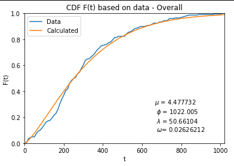{width="4.083333333333333in"
height="2.8958333333333335in"}

As seen above, the CDF from the optimized parameters above are very
accurate in comparison to the CDF obtained from the data. This further
proves the accuracy of methods that were used for this experiment, and
that the final results for the optimization were as close to the maximum
MLE as possibly computed.

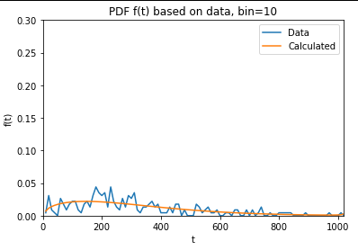{width="3.182292213473316in"
height="2.2176596675415574in"}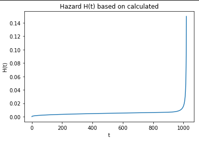{width="3.1849179790026247in"
height="2.2546161417322836in"}

As seen above, there is a (somewhat) accurate PDF in comparison to the
data. PDF's are harder to plot (especially with using the data) since
the PDF is using a continuous domain, which in theory always makes the
probability at any specific time value always equal to 0. Thus, these
plots assume a specific bin size (as shown in the title) to approximate
the graph for the PDF.

Comparing the 3 Datasets
------------------------

When comparing all three datasets (overall, men, and female), several
conclusions can be seen:

{width="2.918744531933508in"
height="2.069909230096238in"}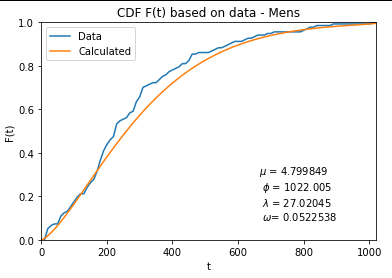{width="2.9285192475940507in"
height="2.0827373140857395in"}

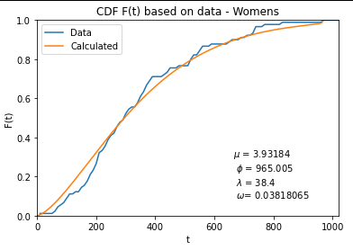{width="2.6707403762029744in"
height="1.8940562117235347in"}

| **Dataset** | **Overall**  |**Mens**  |**Womens**
| ------------| -------------|----------|------------
| **SSE**     | 0.043998     |0.161910  |0.280258

As seen from the graphs and sum of squared errors (SSE) above, the CDF
has a higher error on the women's side than on the men's side, and this
is most likely due to the lower number of samples from women than from
the men. However, despite these errors, the resulting CDFs still
visually appear to be good fits for the data.

An additional test that was performed was a Smirnov-Kolmogorov test to
see if the two samples (the data and our model) come from the same
distribution. The Smirnov-Kolmogorov test is a sort of "goodness of fit"
test commonly used to determine whether the CDF's of two samples belong
to the same distribution. In the case of the project, the CDF was
generated using the "create-cdf" function in R, and then

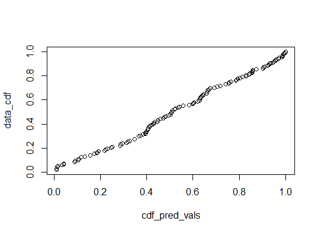{width="2.463542213473316in"
height="1.799309930008749in"}

[PDF Comparison]{.underline}

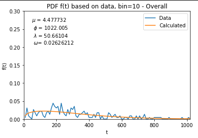{width="2.8006627296587925in"
height="1.9562554680664916in"}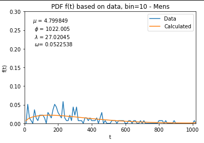{width="2.8006846019247593in"
height="1.9562554680664916in"}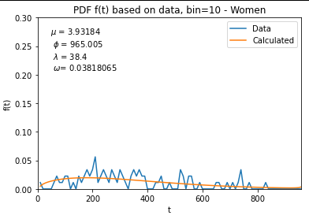{width="2.5107720909886266in"
height="1.7805938320209973in"}

As seen above, the PDF seems to be very "jagged", and this is because
there is a small bin associated with these PDF y values. This method is
needed due to the fact that the probability of dying instantaneously at
a single point in time is essentially zero. Rather, ranges of times were
used to try to visualize the PDFs. Regardless, the results seem somewhat
representative and it would appear that this graph is not as useful for
modeling as compared to the CDF and the hazard rate.

[Hazard Comparison]{.underline}

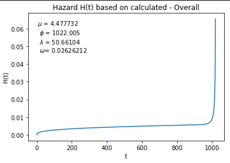{width="3.0930960192475943in"
height="2.1927088801399823in"}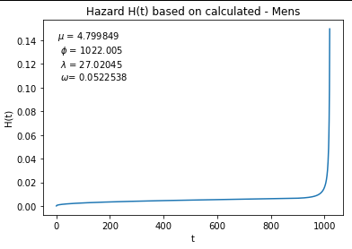{width="3.0966666666666667in"
height="2.1961395450568677in"}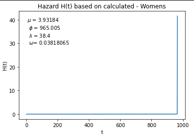{width="3.0887740594925632in"
height="2.1961395450568677in"}

As seen above, all of the hazard plots share the same
gradually-increasing shape (as opposed to the alternate bathtub shape).
The main difference between all three plots is the size of the range.
Particularly, the women's plot is scaled so much larger that the shape
appears to be an exact backwards "L".

 

5.  Discussions/Conclusion
    ======================

    1.  Conclusion
        ----------

Future efforts regarding this data and the models related to it could
involve additional, perhaps more sophisticated ways of optimization, a
more comprehensive exploration of the search space, a collection of more
data to validate and perhaps enhance existing results, and finally,
perhaps the consideration of whether the Weibull Power Function really
is a good fit for the data. The optimization method used made the use of
two R functions whose implementations are presently unknown to the
authors. Without a doubt, there are more efficient and comprehensive
ways of optimizing the log-likelihood function. To name a few, some
methods that could be considered for optimization include: gradient
descent and its variations such as accelerated gradient descent, the
ADAM optimizer, RMSProp, etc...

In addition, something else that must be considered is that the search
space that has been explored in this project is fairly small. The search
space was explored on the basis of technical limitations. For example, a
part of the decisions that were made for exploring some of the variables
were made on the basis of technical limitations related to the accuracy
of the data types used. Moreover, perhaps using some data types with
more floating point precision could lead to less overflows, underflows,
and NaNs as seen in this project's efforts. Last but not least, this
entire approach could be subjected to examination, as the distribution
that we have chosen may in fact, not be a good fit. We have considered
some errors with regards to the CDF, but there are other comparisons
that could be made to other distributions that perhaps model the data in
a more comprehensive way.

One notable lesson we learned in this project is the importance of
analyzing the data beforehand using techniques such as the correlogram.

Challenges 
----------

One major challenge encountered during the optimization portion of the
project was encountering NaNs (overflows, underflows, or in rare cases,
divisions by zero) in the function and gradient evaluations, which would
often cause problems in the optimizers. Specifically, R's optim function
was ill-suited for finding the values for convergences as it would
always return values for parameters which were clearly not optimal. As a
result, alternative logging within the evaluated log-likelihood function
helped determine which converged values caused the maximum value for the
log-likelihood.

As a result of these issues, the maxLik function was used. However, this
would also frequently get NaNs in the gradient, despite continually
returning consistent and accurate parameter values more consistently
than optim. Thus, the optim function was abandoned for the imported
maxLik function.

References
==========

The Weibull-power function distribution with applications - M. H. Tahir∗
, Morad Alizadeh , M. Mansoor , Gauss M. Cordeiro and M. Zubairk

Wackerly, D. D., Mendenhall, W., & Scheaffer, R. L. (2012).
*Mathematical statistics with applications*. Brooks/Cole.

*Package maxlik - cran.r-project.org*. (n.d.). Retrieved December 7,
2022, from
[[https://cran.r-project.org/web/packages/maxLik/maxLik.pdf]{.underline}](https://cran.r-project.org/web/packages/maxLik/maxLik.pdf)

*Karnofsky Performance Status Scale definitions rating (%) criteria -
NPCRC*. (n.d.). Retrieved December 7, 2022, from
http://www.npcrc.org/files/news/karnofsky\_performance\_scale.pdf

Bell, D. J. (2021, August 31). *ECOG performance status: Radiology
reference article*. Radiopaedia Blog RSS. Retrieved December 7, 2022,
from
https://radiopaedia.org/articles/ecog-performance-status?lang=us\#:\~:text=The%20ECOG%20performance%20status%20is,form%20the%20BCLC%20HCC%20staging).

Appendix
========

Phi Convergence Graphs
----------------------

See below for a visual representation proving convergence for each
dataset regardless of the initial value of phi.

[Convergence of Phi for complete dataset:]{.underline}

{width="3.1829866579177604in"
height="1.8361318897637795in"}{width="3.119792213473316in"
height="1.835171697287839in"}

{width="3.175740376202975in"
height="1.7965321522309712in"}

[Convergence of Phi for women data in dataset:]{.underline}

{width="3.1210487751531057in"
height="1.8698458005249343in"}{width="3.1406255468066493in"
height="1.87124343832021in"}

{width="3.1614588801399823in"
height="1.8918963254593175in"}

[Convergence of Phi for men's data in dataset:]{.underline}

{width="3.052484689413823in"
height="1.8344258530183728in"}{width="2.958413167104112in"
height="1.8243547681539807in"}

{width="3.0468755468066493in"
height="1.7717016622922135in"}
